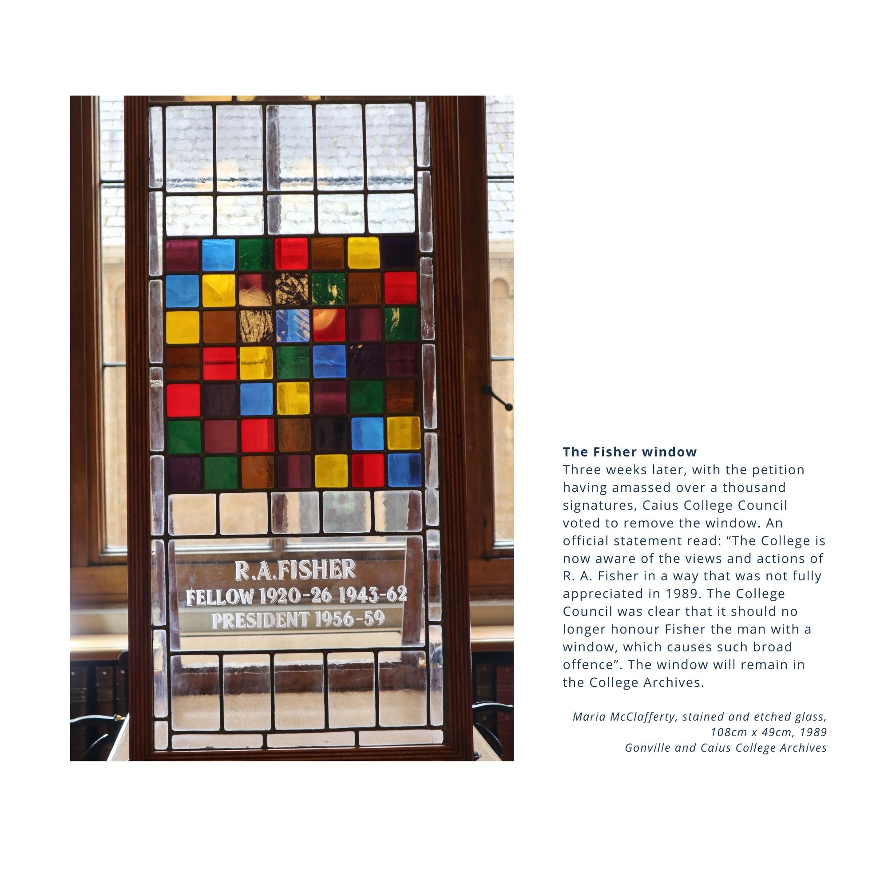
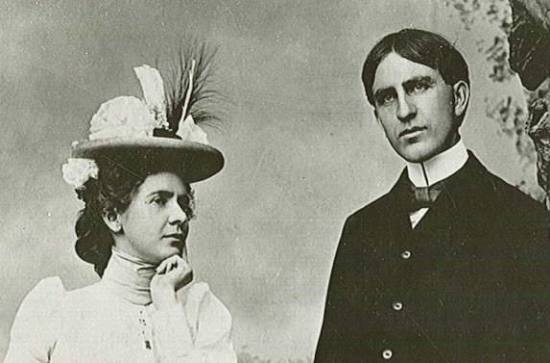
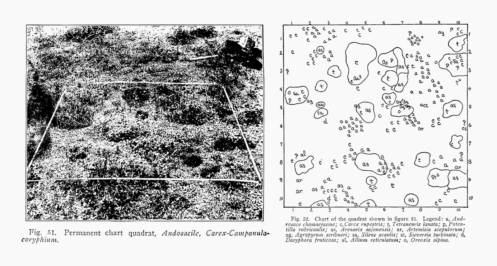
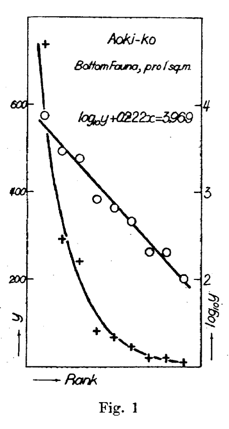
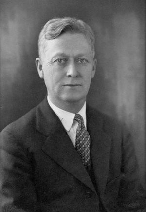
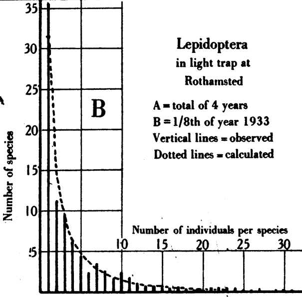
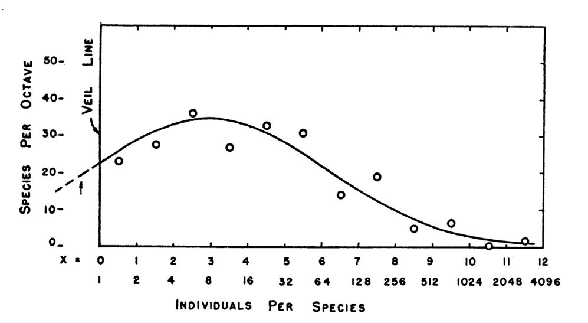
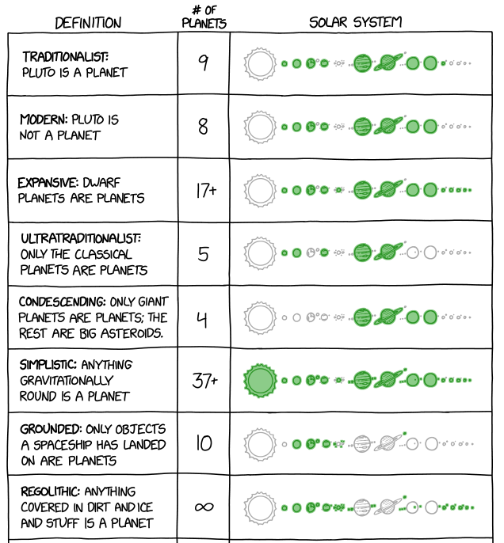

```{r setup, include=FALSE}
options(htmltools.dir.version = FALSE)
options(servr.daemon = TRUE)#para que no bloquee la sesión
knitr::opts_chunk$set(prompt = TRUE, comment = "")
```

```{r xaringan-themer, include=FALSE, warning=FALSE}
library(xaringanthemer)
library(ggplot2)
library(ggforce)
library(ggthemes)
library(knitr)
library(kableExtra)
library(dplyr)
library(tidyr)
library(sads)

xaringanExtra::use_share_again()
xaringanExtra::use_fit_screen()
xaringanExtra::use_tachyons()

style_solarized_light(
  title_slide_background_color = "#586e75",# base 3
  header_color = "#586e75",
  text_bold_color = "#cb4b16",
  background_color = "#fdf6e3", # base 3
  header_font_google = google_font("DM Sans"),
  text_font_google = google_font("Roboto Condensed", "300", "300i"),
  code_font_google = google_font("Fira Mono"), text_font_size = "28px",
  code_font_size="1rem"
)
# clipboard
htmltools::tagList(
  xaringanExtra::use_clipboard(
    button_text = "Copy code <i class=\"fa fa-clipboard\"></i>",
    success_text = "Copied! <i class=\"fa fa-check\" style=\"color: #90BE6D\"></i>",
    error_text = "Not copied 😕 <i class=\"fa fa-times-circle\" style=\"color: #F94144\"></i>"
  ),
  rmarkdown::html_dependency_font_awesome()
  )

```

## Quién soy

.pull-left[
<center>
```{r pi, out.width= "40%", echo=FALSE}

```

**PI**, Paulo Inácio Prado (pronombres: él)
]

.pull-right[
- Bachiller en Biología (1990), Maestría y Doctorado en Ecología
  (1991-1999), en Brasil;
- Profesor en el Departamento de Ecología del Instituto de Biociencias
  USP;
- Ecología de comunidades, ecología teórica, conservación;
- Brasileño, vivo en la ciudad de São Paulo, Brasil;
- Me gusta: aprender, enseñar, buena comida, cocinar, nadar, charlar y
conocer a la gente.  ]


---

## Para que estoy aquí

 - Para ayudarte a entender mejor las distribuciones de abundancia de
   especies y cómo ajustar estos modelos a tus propios datos
   biológicos.
 
 - Para que lo aprendas más rápido y fácil que yo
 
 - Para aprender enseñando, porque la mejor manera de dominar un tema
   es compartiéndolo (soy profesor por esa razón).


<center>
.left-column[
```{r mural, out.width= "100%", echo=FALSE}

```
]
</center>

.right-column[
> «Nadie educa a nadie, nadie se educa a sí mismo, las personas se educan entre sí, mediadas por el mundo»
>
> Paulo Freire
]

---

## Estrategias pedagógicas

.pull-left[

- Clases dialogadas
 
- Tutoriales en R

- Ejercícios

- Todos los recursos de aprendizaje en https://piklprado.github.io/sads_UNAM/
 
]
 
 .pull-right[

```{r autonomia, echo=FALSE, out.width=896, fig.align='center', fig.link="https://obind.eco.br/funai-educacao-indigena-instrucao-normativa-da-funai-promove-direitos-e-autonomia-dos-povos-indigenas-de-recente-contato/"}

```
 
]
 
---
## Programa

#### 1. Introducción: historia, motivación, teoría y conceptos

#### 2. Ajuste por el método de la verosimilitud

#### 3. Ajuste a datos de frecuencia en clases de abundancia o cobertura

---
class: inverse, middle

.col-container[
.col[
# Un poco de historia
]

.col[
.center[


[Contested legacies: R.A. Fisher in retrospect](https://www.cai.cam.ac.uk/discover/fisher-21st-century/contested-legacies-ra-fisher-retrospect)
]
]
]

---

## La idea de cuantificación

.pull-left[
 
* Una de las ideas fundadoras de la ecología es la **cuantificación**, como
   forma de obtener descripciones precisas de la naturaleza.
 
* El campo que hoy llamamos **ecología vegetal** fue pionero en
usar conteos y mediciones para caracterizar formaciones vegetales.  ]

.pull-right[ <iframe
src="https://archive.org/details/researchmethodsi00clem/page/161/mode/1up"
width="560" height="500" frameborder="0" webkitallowfullscreen="true"
mozallowfullscreen="true" allowfullscreen></iframe> ]


---

## Cuantificación de abundancias

.pull-left[
A partir de fines del siglo XIX, parcelas cuadradas o circulares
comenzaron a usarse para registrar la abundancia de especies de
plantas en diferentes partes del mundo (predominantemente en Europa y EE.UU.).
]
.pull-right[
<div style="text-align:center">

<p style="font-size:0.7em; margin-top:2px">La pareja Clements (<a href="https://digitalcommons.unl.edu/cgi/viewcontent.cgi?article=1000&context=unsmaffil" target="_blank">Oberg, 2019</a>)</p>
</div>
<div style="text-align:center; margin-bottom:10px">

<p style="font-size:0.7em; margin-top:2px">Parcelas de Clements. (<a href="https://journals.openedition.org/transbordeur/1307" target="_blank">Hughes 2024</a>)</p>
</div>
]


---

## Un patrón

.pull-left[

Pronto se percibió que en estas muestras la mayoría de las especies era rara,
mientras que muy pocas especies tenían gran abundancia. 

Este sigue siendo uno de los patrones empíricos más generales en ecología.
]

.pull-right[ 
<div style="text-align:center">  <p
style="font-size:0.7em; margin-top:2px"> <a
href="https://oikosjournal.wordpress.com/2012/11/22/with-inspiration-from-the-past/"
target="_blank">Isao Motomura (1904-1981)</a></p> </div> 

> "In a community, there are generally many more species with relatively low abundances."
>
> Motomura (1932), apud [Doi & Mori 2012](https://nsojournals.onlinelibrary.wiley.com/doi/abs/10.1111/j.1600-0706.2012.00068.x)
]

---

## El primer modelo

.pull-left[ 

* Motomura (1932) propuso la primera descripción gráfica de una
  distribución de abundancia de especies: un gráfico del logaritmo de
  la abundancia de cada especie en función del orden de abundancia de
  la especie.

* También propuso el primer modelo matemático para una SAD: una
  relación lineal entre el logaritmo de la abundancia ($y$) y la orden
  de abundancia de las especies ($R$):

$$\log (y)  = a - b R$$
]

.pull-right[
<div style="display:flex; align-items:flex-start; width:100%">

<blockquote style="font-size:0.85em; margin:0 0 0 10px; padding-left:10px; border-left:3px solid #ccc">
"When the species found within a quadrat are ranked according to abundance (i.e. the order of dominance in the community), a definite graphic pattern is observed between the rank and abundance of species"
<br><br>
Motomura (1932), apud <a href="https://nsojournals.onlinelibrary.wiley.com/doi/abs/10.1111/j.1600-0706.2012.00068.x" target="_blank">Doi &amp; Mori 2012</a>
</blockquote>
</div>]

---

## Las SAD como distribuciones de probabilidad

.pull-left[

* El estadístico, genetista y eugenista Ronald Fisher fue el primero
  en describir las SAD con una distribución de probabilidad, usando datos
  de los entomólogos C. Williams y S. Corbet.

* Fisher propuso que las abundancias de especies en una muestra varían
  debido a diferencias en las abundancias de las especies y también al error
  muestral.

* Así, un modelo de SAD debe definir la **probabilidad** de
observar cada abundancia posible en una **muestra**. 

] 

.pull-right[
<div style="text-align:center"> 
 <p style="font-size:0.7em; margin-top:2px">
<a href="https://www.npg.org.uk/collections/search/portrait/mw93489/Sir-Ronald-Aylmer-Fisher?_gl=1*1xkj9kl*_up*MQ..*_ga*Mzc2MTQ3MDk4LjE3ODg2NTA3NTA.*_ga_3D53N72CHJ*czE3ODg2NTA3NDkkbzEkZzEkdDE3ODg2NTA3NTUkajU0JGwwJGgw"
target="_blank">Ronald Fisher (1890-1962)</a></p> </div> 
<div style="text-align:center"> 
 <p style="font-size:0.7em; margin-top:2px"><a
href="https://doi.org/10.1098/rsbm.1982.0025"
target="_blank">C. B. Williams (1889-1981)</a></p> </div> 
]

---

## Las SAD como distribuciones de probabilidad

.pull-left[

* El modelo de Fisher es un caso límite de la distribución
  binomial negativa truncada en cero, que después se conoció como
  **log-series**.

* En este modelo, la probabilidad de registrar
$n$ individuos de cualquier especie en una muestra es proporcional a: 

$$\frac{\alpha X^n}{n}$$

donde $X$ y $\alpha$ son parámetros de la distribución de probabilidad.
]

.pull-right[
<div style="text-align:center; margin-bottom:10px">

<p style="font-size:0.7em; margin-top:2px">Ajuste de la log-series a la frecuencia de especies de mariposas nocturnas por número de individuos capturados en trampas de luz. (<a href="https://www.jstor.org/stable/1411" target="_blank">Fisher et al. 1943</a>)</p>
</div>
]

---

## Las SAD como distribuciones de probabilidad

.pull-left[

* Preston (1948) categorizó las abundancias de especies en escala
  logarítmica de base 2 (**octavas**).

* Su modelo es una distribución normal en esta escala, es decir, una
  distribución **lognormal** de las abundancias.

* La cola izquierda de la distribución estaría escondida por una
  "línea de velo", debido al truncamiento en la abundancia mínima
  observable en la muestra.
  
* El aumento del muestreo "desplaza el velo", revelando la curva
completa.

]

.pull-right[ 
<div style="text-align:center"> 
 
<p style="font-size:0.7em; margin-top:2px">
<a href="https://www.jstor.org/stable/20167145"> Frank Preston
(1890-1962)</a></p> </div> <div style="text-align:center"> 

<p style="font-size:0.7em; margin-top:2px"> Número de especies de
mariposas nocturnas por clase de abundancia en log2 (octavas), y línea del
ajuste de la distribución lognormal, truncada en el valor 1 <a
href="https://www.jstor.org/stable/1930989" target="_blank">(Preston,
1948)</a></p> </div> 
]

---
## Modelos de mecanismos

.pull-left[

* [Numata *et al.*
(1953)](https://www.jstage.jst.go.jp/article/bse/3/3/3_KJ00001586575/_pdf/-char/en)
propusieron el primer modelo de proceso ecológico para SAD: si la
especie dominante toma una fracción $k$ de todo el recurso, la segunda
especie toma la misma fracción del recurso que sobra y así
sucesivamente, las abundancias siguen la serie geométrica de Motomura (1932).

* Hay muchos otros modelos de SAD derivados de procesos, como los
de partición de nichos (MacArthur 1957, Sugihara 1980, Tokeshi
1990) y modelos neutros (Caswell 1976, Hubbell 2001).  ]

.pull-right[
.center[
```{r geometric_part, eval=TRUE, echo=FALSE, fig.height=6}
# 1. Datos de las barras/rectángulos
df_rects <- data.frame(
  etapa = factor(c(
    "1. Recurso Total",
    "2. E1 toma el 50%", "2. E1 toma el 50%",
    "3. E2 toma el 25%", "3. E2 toma el 25%", "3. E2 toma el 25%",
    "4. E3 toma el 12,5%", "4. E3 toma el 12,5%", "4. E3 toma el 12,5%", "4. E3 toma el 12,5%"
  ), levels = c("1. Recurso Total", "2. E1 toma el 50%", "3. E2 toma el 25%", "4. E3 toma el 12,5%")), 
  xmin = c(
    0,
    0, 50,
    0, 50, 75,
    0, 50, 75, 87.5
  ),
  xmax = c(
    100,
    50, 100,
    50, 75, 100,
    50, 75, 87.5, 100
  ),
  rotulo = c(
    "Resto (100%)",
    "Especie 1 (50%)", "Resto (50%)",
    "Especie 1 (50%)", "Especie 2 (25%)", "Resto (25%)",
    "Especie 1 (50%)", "Especie 2 (25%)", "E3 \n (12,5%)", "Resto..."
  ),
  tipo = c(
    "Resto",
    "E1", "Resto",
    "E1", "E2", "Resto",
    "E1", "E2", "E3", "Resto"
  )
)
y_map <- c("1. Recurso Total" = 4, "2. E1 toma el 50%" = 3, "3. E2 toma el 25%" = 2, "4. E3 toma el 12,5%" = 1)
df_rects$ymin <- y_map[as.character(df_rects$etapa)] - 0.25
df_rects$ymax <- y_map[as.character(df_rects$etapa)] + 0.25
df_rects$x_centro <- (df_rects$xmin + df_rects$xmax) / 2
df_rects$y_centro <- (df_rects$ymin + df_rects$ymax) / 2
# 2. Datos de las flechas dinámicas (partiendo del centro del "Resto")
df_setas <- data.frame(
  x = c(50, 75, 87.5),          # Mitad del espacio restante superior
  y = c(3.70, 2.70, 1.70),       # Borde inferior de la barra de origen
  xend = c(50, 75, 87.5),       # Apunta verticalmente hacia abajo
  yend = c(3.30, 2.30, 1.30)     # Borde superior de la barra destino
)
# 3. Construcción del gráfico
ggplot() +
  geom_rect(data = df_rects, aes(xmin = xmin, xmax = xmax, ymin = ymin, ymax = ymax, fill = tipo),
            color = "black", linewidth = 0.6) +
  geom_text(data = df_rects, aes(x = x_centro, y = y_centro, label = rotulo),
            size = 3.3, fontface = "bold", color = "black") +
  # Dibujar las flechas de división
  geom_segment(data = df_setas, aes(x = x, y = y, xend = xend, yend = yend),
               arrow = arrow(length = unit(0.20, "cm"), type = "closed"),
               linewidth = 0.7, color = "red3") +
  scale_fill_manual(values = c(
    "E1" = "#6baed6",
    "E2" = "#9ecae1",
    "E3" = "#c6dbef",
    "Resto" = "#e0e0e0"
  )) +
  scale_y_continuous(breaks = 1:4, labels = rev(names(y_map))) +
  scale_x_continuous(labels = function(x) paste0(x, "%")) +
  labs(
    title = "Serie Geométrica: Partición de Nicho (k = 0,5)",
    x = "Proporción del Recurso Total (%)",
    y = NULL
  ) +
  theme_minimal(base_size = 12) +
  theme(
    legend.position = "none",
    panel.grid.minor = element_blank(),
    panel.grid.major.y = element_blank(),
    plot.title = element_text(face = "bold", size = 14),
    axis.text.y = element_text(face = "bold", color = "black")
  )
```
]]

---

## En resumen: qué sabemos después de más de un siglo

* Más de 40 modelos propuestos, sin señales de agotamiento ([Marquet *et al.* 2003](https://books.google.com.br/books?id=3vUUii37DEQC&lpg=PA64&ots=HKB34n5eS5&dq=marquet%202003%20breaking%20the%20stick&lr&hl=pt-BR&pg=PA73#v=onepage&q&f=false), [McGill *et al.* 2007](https://onlinelibrary.wiley.com/doi/epdf/10.1111/j.1461-0248.2007.01094.x));

* No se encontró ningún modelo universal, pero tampoco se rechazó
  definitivamente ningún modelo;

* Modelos deducidos de ciertos procesos se ajustan a datos que no
  fueron generados por esos procesos (p. ej. el modelo neutro);

* De todos modos, las SAD siguen siendo un patrón fundamental en ecología:
  la descripción cuantitativa más sintética de los patrones de abundancia y
  rareza de las especies en las comunidades.


---
class: inverse, middle

.col-container[
.col[
# Conceptos y definiciones
]

.col[
.center[


["Planet definitions", xkcd](https://xkcd.com/3063/)
]
]
]

---


## Gráficos de SAD: diagrama de rango-abundancia

.pull-left[ 

* Grafica el logaritmo de la
abundancia de cada especie (eje y) en función del rango (orden) de la especie,
ordenadas de la más abundante a la más rara (eje x).  

* La función `rad` del paquete `sads` crea una tabla con los valores de los
rangos y abundancias, que puede luego usarse para producir el gráfico
con la función `plot`: 

```{r code-rank-abund, eval=FALSE}
## En R classico
plot( rad(moths) )
## Con "pipe" nativo de R
rad(moths) |> plot()
```

]

.pull-right[

```{r rankabundance-plot, echo=FALSE, fig.align='center', fig.height=5.5, fig.cap="Diagrama de rango-abundancia de mariposas nocturnas capturadas con trampa de luz en la estación de Rothamsted 1933-1936 (Williams 1943)"}
rad(moths) |> plot()
```
]

---

## Gráficos de SAD: histograma de octavas

.pull-left[ 

* Es un histograma del número de especies en cada clase de
  abundancia. Las clases están en intervalos de potencia de dos 
  ( $2^0 , 2^1, 2^2, \ldots$ ), que Preston (1948) denominó "octavas".

* La función `octav` del paquete `sads` crea una tabla con el número de
especies por octavas, que puede luego usarse para producir el gráfico
con la función `plot`:

```{r code-octave, eval=FALSE}
## En R classico
plot( ocatv(moths) )
## Con "pipe" nativo de R
octav(moths) |> plot()
```

]

.pull-right[

```{r octave-plot, echo=FALSE, fig.align='center', fig.height=5.5, fig.cap="Número de especies por octavas, mariposas nocturnas capturadas con trampa de luz en la estación de Rothamsted 1933-1936 (Williams 1943)"}
octav(moths) |> plot()
```
]

---

## Modelos de SAD

.pull-left[ 

* Los modelos de SAD son distribuciones de probabilidad, es decir, son
  funciones matemáticas que asignan probabilidades a cada evento de un
  espacio muestral. Hay dos tipos de modelos, cada uno con su propio espacio
  muestral:
  
  * Distribuciones de la probabilidad de abundancias
  
  * Distribuciones de la probabilidad de rangos de abundancia 
]

.pull-right[

```{r distribuciones, echo=FALSE, fig.align='center', echo=FALSE}
par(cex.axis = 1.25, cex.lab = 1.25, cex.main=1.5, mar = c(6,7.5,4,2), mgp=c(3.5,1,0),  bty = "l", las=1, mfrow=c(2,1))
x <- 1:20
y <- dls(x, N=1000, alpha = 30)
plot(y~x, xlab = "Abundancia", ylab = "Probabilidad", main= "Modelo log-series de abundancia de las especies")
x <- 1:10
y <- dgs(x, k = 0.25, S =10)
plot( y~x, xlab = "Rango", ylab = "Probabilidad", main= "Serie geométrica de rangos de los individuos")

```
]

---

## Modelos de SAD

En el paquete `sads` cada modelo tiene las funciones estándar para
  distribuciones de probabilidad con los siguientes prefijos: 

  * `d` para densidad de probabilidad: `dpoilog`, `dls` ... 
  
  * `p` para probabilidad acumulada: `ppoilog`, `pls` ...
  
  * `q` para función cuantil: `qpoilog`, `qls` ...
  
  * `r` para generar sorteos de la distribución: `rpoilog`, `rls` ... 

---

## Ejemplos

### Función de densidad

Probabilidad de que un individuo de la muestra pertenezca a la segunda especie
más abundante, según la serie geométrica

```{r}
dgs(x = 2, k = 0.5, S = 10)
```

### Función de probabilidad acumulada
Probabilidad de que una especie tenga hasta 5 individuos en una distribución log-series
```{r}
pls(q = 3, alpha = 30, N = 500)
```

---

## Ejemplos 

### Función cuantil
Qué abundancia acumula la mitad de las especies en una distribución
log-series

```{r}
qls(p = 0.5, alpha = 30, N = 500)
```

### Sorteo de una distribución
Sorteo de 5 valores de rangos de una distribución Zipf-Mandelbrot
```{r}
rmand(n = 5, s = 2, v = 1, N = 500)
```
---

## Parámetros de los modelos
.pull-left[
* Cada modelo de distribución de probabilidad tiene sus parámetros,
  que definen la forma, posición y dispersión de las probabilidades.
  
* Por ejemplo:
  * El parámetro $\alpha$ de la log-series afecta la riqueza de
    especies y la proporción de especies raras
  * El parámetro $k$ de la serie geométrica define la dominancia de las especies
	 de mayor rango

* Los modelos de SAD tienen entre uno y tres parámetros, en general.	 
]

.pull-right[
```{r parametros, echo=FALSE, fig.align='center', echo=FALSE}

par(cex.axis = 1.25, cex.lab = 1.25, cex.main=1.5, mar = c(6,7.5,4,2), mgp=c(3.5,1,0),  bty = "l", las=1, mfrow=c(2,1))
## Logseries
x <- 1:10
alphas <- c(10,50,200)
y1 <- dls(x, N=1000, alpha = alphas[1])
y2 <- dls(x, N=1000, alpha = alphas[2])
y3 <- dls(x, N=1000, alpha = alphas[3])
plot(y3~x, xlab = "Abundancia", ylab = "Probabilidad",
     main= "Modelo log-series de abundancia de las especies", type="b")
points(y2~x, type ="b", col =2)
points(y1~x, type ="b", col =3)
legend("topright",
       legend= c(bquote(alpha == .(alphas[1])),
         bquote(alpha == .(alphas[2])),
         bquote(alpha == .(alphas[3]))),
       lty=1, col=3:1, pch=1,
       bty="n", cex=1.25)
## Serie geometrica
ks <- c(0.5, 0.25, 0.1)
y1 <- dgs(x, k = ks[1], S =10)
y2 <- dgs(x, k = ks[2], S =10)
y3 <- dgs(x, k = ks[3], S =10)
plot(y1~x, xlab = "Rango", ylab = "Probabilidad", main= "Serie geométrica de rangos de los individuos", type="b")
points(y2~x, type ="b", col =2)
points(y3~x, type ="b", col =3)
legend("topright",
       legend= paste("k = ", ks[3:1]),
       lty=1, col=3:1, pch=1,
       bty="n", cex=1.25)

```
]
---

## Qué hacer ahora

.left-column[
```{r , echo=FALSE, fig.align='center'}

```
]

.right-column[

### Bora lá!

Encuentra en nuestro sitio los [tutoriales](https://piklprado.github.io/sads_UNAM/docs/01_introduccion.html)

* **Gráficos** - *La línea de corte de Preston*

* **Parametros** - *De los parámetros a la forma de la SAD*

           
]
