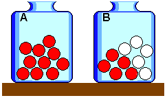

```{r setup, include=FALSE}
options(htmltools.dir.version = FALSE)
options(servr.daemon = TRUE)#para que no bloquee la sesión
knitr::opts_chunk$set(prompt = TRUE, comment = "",
                      out.width="90%", echo=FALSE,
                      warning=FALSE, message=FALSE)
```

```{r xaringan-themer, include=FALSE, warning=FALSE}
library(xaringanthemer)
library(ggplot2)
library(ggforce)
library(ggthemes)
library(metR)
library(plotly)
library(knitr)
library(kableExtra)
library(htmltools)
library(dplyr)
library(tidyr)
library(sads)

xaringanExtra::use_share_again()
xaringanExtra::use_fit_screen()
xaringanExtra::use_tachyons()

style_solarized_light(
  title_slide_background_color = "#586e75",# base 3
  header_color = "#586e75",
  text_bold_color = "#cb4b16",
  background_color = "#fdf6e3", # base 3
  header_font_google = google_font("DM Sans"),
  text_font_google = google_font("Roboto Condensed", "300", "300i"),
  code_font_google = google_font("Fira Mono"), text_font_size = "28px",
  code_font_size="1rem"
)
# clipboard
htmltools::tagList(
  xaringanExtra::use_clipboard(
    button_text = "Copy code <i class=\"fa fa-clipboard\"></i>",
    success_text = "Copied! <i class=\"fa fa-check\" style=\"color: #90BE6D\"></i>",
    error_text = "Not copied 😕 <i class=\"fa fa-times-circle\" style=\"color: #F94144\"></i>"
  ),
  rmarkdown::html_dependency_font_awesome()
  )

```


## ¿Cómo ajustar modelos estadísticos?

.pull-left[

* Los modelos estadísticos son funciones que asignan probabilidades a cada
  observación.

* Modelos con valores diferentes de los parámetros asignarán
  probabilidades diferentes a los datos.

* Un criterio: para ajustar modelos a los datos, **buscamos los valores de
  parámetros que asignan la mayor probabilidad** posible a los datos.

]

.pull-right[

```{r ejemplo-ajuste-ls }

moths.oc <- octav(moths)
moths.ls <- fitls(moths)
moths.ls.oc <- octavpred(moths.ls)
moths.a <- coef(moths.ls)["alpha"]
moths.ls2.oc <- octavpred(moths, sad = "ls",
                          coef=list(N=sum(moths), alpha = 200))
plot(moths.oc, prop=TRUE,
     xlab = "Clase de abundancia (octava)",
     ylab = "Probabilidad", ylim = c(0,.3))
lines(moths.ls.oc, prop=TRUE, lwd=1.5)
lines(moths.ls2.oc, prop=TRUE, col = "red", lwd=1.5)
v1 <- round(moths.a)
v2 <- round(200)
legend("topright", legend= c(bquote(alpha == .(v1)),
                             bquote(alpha == .(v2))),
       pch=1, lty=1, col=c("blue", "red"),
       cex = 1.25, bty = "n")

```

]

---

### La ley de verosimilitud (enunciado informal)

.bg-washed-blue.b--navy.ba.bw2.br3.shadow-5.ph4.mt1[
.center[**SI**]

* Hay varios modelos para describir un mismo conjunto de datos, 

* y cada modelo asigna probabilidades diferentes a los datos
]

--

.center[
.bg-washed-blue.b--navy.ba.bw2.br3.shadow-5.ph4.mt4[
**ENTONCES**

El modelo que asigna la mayor probabilidad a los datos es el mejor
apoyado por los datos, o el modelo más plausible.  ]
]

---

## Ley de verosimilitud: un ejemplo sencillo

.pull-left[

**Dos modelos**

* $M_A$: todas las bolas de la urna son rojas

* $M_B$: la mitad de las bolas son rojas y la mitad son blancas

**Recolección de datos**

Sacar bolas al azar de la urna, con reemplazo
]

.center[
.pull-right[
```{r }

```
]]

---

##Ley de verosimilitud: un ejemplo sencillo

### Una sola extracción, y la bola es roja

$$
\begin{align}
\\
P(\text{roja} \mid M_A) & = 1 \\[1em]
P(\text{roja} \mid M_B) & = 0.5
\\
\end{align}
$$

$M_A$ es $\frac{1}{0.5}\; = \; 2$ veces más plausible (o mejor
apoyado por la observación) que $M_B$.

---

##Ley de verosimilitud: un ejemplo sencillo

### Dos extracciones, ambas bolas rojas

$$
\begin{align}
\\
P(\{\text{roja, roja}\} \mid M_A) & = 1 \times 1 = 1\\[1em]
P(\{\text{roja, roja}\} \mid M_B) & = 0.5 \times 0.5 = 0.25
\\
\end{align}
$$

$M_A$ es $\frac{1}{0.25}\; = \; 4$ veces más plausible (o mejor
apoyado por las observaciones) que $M_B$. <sup>1</sup> 

.footnote[[1] bajo el supuesto de que los datos son observaciones independientes]

---

## La función de verosimilitud

Cualquier función proporcional al producto de probabilidades asignadas por
un modelo estadístico a cada observación de los datos:


.bg-washed-blue.b--navy.ba.bw2.br3.shadow-5.ph4.mt5[
$$ \mathcal{L} \propto P(y_1 \mid M) \times P(y_2 \mid M) \times \ldots P(y_i \mid M)$$
]

--

.bg-washed-blue.b--navy.ba.bw2.br3.shadow-5.ph4.mt5[
$$ \mathcal{L} \propto \prod^N P(y_i \mid M)$$
]

---

## Una función de verosimilitud

El producto de probabilidades asignadas por
un modelo estadístico a cada observación de los datos:


.bg-washed-blue.b--navy.ba.bw2.br3.shadow-5.ph4.mt5[
$$ \mathcal{L} = \prod^N P(y_i \mid M)$$
]

---

## La función de log-verosimilitud

El logaritmo de la función de verosimilitud, es decir, la **suma del
logaritmo de las probabilidades** asignadas por un modelo a cada
observación de los datos <sup>2</sup> :

.bg-washed-blue.b--navy.ba.bw2.br3.shadow-5.ph4.mt5[
$$ \textbf{L} = \sum^N \ln P(y_i \mid M)$$
]


.footnote[[2] o cualquier función proporcional a esta suma]

---
class: middle
## Ejemplo del cálculo de la verosimilitud

.col-container[
.col[

```{r ejemplo2-calculos, , results="asis"}

res_final <-
    table(moths) |>
    as.data.frame() |>
    rename(Abund = moths) |>
    mutate(Abund = as.numeric(as.character(Abund)),
           p = dls(Abund, N = sum(moths), alpha = moths.a),
           lp = log(p),
           slp = Freq * lp) |>
    filter(Abund<=6) |>
    mutate(
        Abund = as.character(Abund),
        Freq  = as.character(Freq),
        p     = sprintf("%.3f", p),
        lp    = sprintf("%.3f", lp),
        slp   = sprintf("%.3f", slp)) |>
    rbind(data.frame(Abund = ". . .", Freq = "", p = "", lp = "", slp = "")) |>
    rbind(data.frame(Abund = "",Freq  = "",p     = "",lp    = "Suma",
                     slp   = sprintf("%.1f", as.numeric(logLik(moths.ls)))))
tbl <- kable(res_final,
      format = "html",
      align = "c",
      escape = FALSE,
      col.names = c("Abund. (\\(x\\))", 
                    "N especies (\\(N\\))", 
                    "\\(P(x)\\)", 
                    "\\(\\ln P(x)\\)", 
                    "\\(N \\ln P(x)\\)")) |>
    kable_styling(full_width = FALSE) |>
    row_spec(7, background = "#f0f4f8", color = "#005f73", bold = TRUE) |>
    row_spec(8, bold = TRUE) 

cat(htmltools::htmlPreserve(as.character(tbl)))

```
]

.col[
.center[
```{r ejemplo2-ajuste-ls }
plot(moths.oc, prop=TRUE,
     xlab = "Clase de abundancia (octava)",
     ylab = "Probabilidad", ylim = c(0,.3))
lines(moths.ls.oc, prop=TRUE, lwd=1.5)
legend("topright", legend= c(bquote(alpha == .(v1))),
       pch=1, lty=1, col="blue",
       cex = 1.25, bty = "n")
```
]]]

---

## Ajuste por Máxima Verosimilitud

.pull-left[

```{r }
alfa <- 200
x <- 1:200
moth.ls.ll <- function(x)
    sum(dls(moths, N=sum(moths), alpha=x, log=TRUE))
x.ll <- sapply(x, moth.ls.ll)
p1 <- function(y){
    plot(x.ll ~ x, type ="l", col ="darkblue",
     xlab = "Alfa", ylab = "Log-verosimilitud",
     main="Log-series ajustada a los datos de mariposas", lwd=1.25)
    points(alfa, x.ll[x==y], col = "red", pch=19, cex =2)
}
p1(alfa)

```
]
.pull-right[

```{r  }

p2 <- function(x){
    y <- octavpred(moths, sad = "ls",
              coef=list(N=sum(moths), alpha = x))
    plot(moths.oc, prop=TRUE,
         xlab = "Clase de abundancia (octava)",
         ylab = "Probabilidad", ylim = c(0,.3))
    lines(y, prop=TRUE, lwd=1.5, col="red")
    legend("topright", legend= c(bquote(alpha == .(x))),
           pch=1, lty=1, col="red",
           cex = 1.25, bty = "n")
}
p2(alfa)
```
]

---

## Ajuste por Máxima verosimilitud

.pull-left[

```{r  }
alfa <- 150
p1(alfa)
```
]
.pull-right[

```{r  }
p2(alfa)
```
]

---

## Ajuste por Máxima verosimilitud

.pull-left[

```{r  }
alfa <- 100
p1(alfa)
```
]
.pull-right[

```{r  }
p2(alfa)
```
]

---

## Ajuste por Máxima verosimilitud

.pull-left[

```{r  }
alfa <- 40
p1(alfa)
```
]
.pull-right[

```{r  }
p2(alfa)
```
]

---

## Ajuste por Máxima verosimilitud

.pull-left[

```{r  }
alfa <- 10
p1(alfa)
```
]
.pull-right[

```{r  }
p2(alfa)
```
]

---

## Ajuste por Máxima verosimilitud

.pull-left[

```{r  }
alfa <- 2
p1(alfa)
```
]
.pull-right[

```{r  }
p2(alfa)
```
]

---
 
## En resumen

* Ajustar un modelo por el método de máxima verosimilitud equivale a
  encontrar la combinación de parámetros del modelo que maximizan su
  función de verosimilitud, **para un cierto conjunto de datos**.

--

* Decimos que esta combinación de parámetros es la que tiene el mayor apoyo de
  los datos, o que es el más plausible, para este modelo.

--

* La diferencia de log-verosimilitud entre dos ajustes expresa
  cuánto más plausible es un ajuste, respecto a otros.

--

* Los valores de los parámetros obtenidos por este método se llaman
  *estimaciones de máxima verosimilitud* (**mle**), y tienen varias
  propiedades estadísticas interesantes.

--

* Muchos de los métodos de ajuste de modelos estadísticos más conocidos
  son casos particulares del método de máxima verosimilitud, como
  mínimos cuadrados o ajustes de *glms* (método *iwls*).

---

## Más parámetros: superficie de verosimilitud

```{r moths-poilog }

moths.pl <- fitpoilog(moths)
mpl.ll <- Vectorize(moths.pl@minuslogl)
cfs <- round(coef(moths.pl),1)
mus <- seq(cfs[1]*.75, cfs[1]*1.25, by=0.05)
sigs <- seq(cfs[2]*.75, cfs[2]*1.25, by=0.05)
perfil <- -outer(mus, sigs, mpl.ll)-logLik(moths.pl)
mle_pt <- coef(moths.pl)
mle_z <- max(perfil)
```

```{r moth-pl-superficie, , , message=FALSE, warning=FALSE, fig.height=6, out.width='100%', out.height='500px'}
plot_ly(height = 500) |> # Define la altura interna del contenedor Plotly (en pixeles)
  add_surface(
    x = ~mus, y = ~sigs, z = ~perfil,
    colorscale = "YlOrRd",
    reversescale = TRUE,
    showscale = FALSE,
    contours = list(
      z = list(show = TRUE, usecolormap = TRUE, project = list(z = TRUE))
    )
  ) |>
  add_trace(
    type = "scatter3d",
    mode = "markers+text",
    x = mle_pt[1], y = mle_pt[2], z = mle_z,
    marker = list(size = 6, color = "red"),
    text = "MLE",
    textposition = "top center",
    textfont = list(color = "red", size = 14)
  ) |>
  layout(
    autosize = TRUE,
    margin = list(l = 10, r = 10, b = 10, t = 10), # Reduce márgenes externos innecesarios
    scene = list(
      xaxis = list(title = "mu"),
      yaxis = list(title = "sigma"),
      zaxis = list(title = "Log-verosimilitud")
    )
  ) |>
  config(displayModeBar = FALSE) # Deshabilita la barra de herramientas (íconos superiores)
```

---

## Superficie de una Poisson-lognormal

.pull-left[

```{r moth-pl-perfil }

df_perfil <- expand.grid(mu = mus, sig = sigs)
df_perfil$z <- as.vector(perfil)
niveles <- c(-36, -24, -16, -12, -8, -4, -2, 0)
ggplot(df_perfil, aes(x = mu, y = sig, z = z)) +
  geom_contour_filled(breaks = niveles) +
  geom_contour(breaks = setdiff(niveles, -2), color = "black", linewidth = 0.3) +
  geom_contour(breaks = -2, color = "red", linewidth = 1) +
  geom_text_contour(breaks = niveles, size = 4.5, stroke = 0.15, stroke.color = "white") +
  geom_vline(xintercept = mle_pt[1], linetype = "dashed", color = "red", linewidth = 0.6) +
  geom_hline(yintercept = mle_pt[2], linetype = "dashed", color = "red", linewidth = 0.6) +
  annotate("point", x = mle_pt[1], y = mle_pt[2], color = "red", size = 3.5, shape = 19) +
  annotate("text", x = mle_pt[1], y = mle_pt[2], label = "MLE", color = "red", size = 5, fontface = "bold", hjust = -0.3, vjust = -0.3) +
  scale_fill_brewer(palette = "YlOrRd", direction = -1) +
  labs(x = expression(mu), y = expression(sigma)) +
  theme_minimal() +
  theme(
    legend.position = "none",
    panel.grid = element_blank(),
    axis.title = element_text(size = 18),
    axis.text = element_text(size = 14)
  )

```
]

.pull-right[
```{r moths-pl-oct }

cf.pl <- round(coef(moths.pl),3)
moths.pl.oc <- octavpred(moths.pl)
plot(moths.oc, prop=TRUE,
     xlab = "Clase de abundancia (octava)",
     ylab = "Probabilidad",
     main = paste0("Mariposas nocturnas - Ajuste Poisson-lognormal\n",
                    "\u03BC = ", cf.pl[1], "    \u03C3 = ", cf.pl[2]))
lines(moths.pl.oc, prop=TRUE, lwd=1.5)

```
]

---

## El ajuste de modelos con el paquete `sads`

.pull-left[

* El paquete ajusta por máxima verosimilitud los modelos de SADs más usados, con 3 funciones:
  
  * `fitsad()` para abundancias de especies
  * `fitsadC()` para clases de abundancia (e.g. cobertura)
  * `fitrad()` para rankings de abundancia

* Primer argumento (`x`): un vector numérico con los datos
* Segundo argumento (`sad`): el nombre del modelo.

]
.pull-right[
#### Ajuste de la log-series a los datos de BCI
```{r bci-ls-ajuste, echo = TRUE}
(bci.ls <- fitsad(x = bci, sad = "ls"))
```
]

---
## Objetos de modelos en el paquete `sads`

.pull-left[

El ajuste resulta en un objeto con todos los métodos usuales para objetos
  de modelos de **R**, como:

* `coef()` para valores de los coeficientes del modelo (*mle*s) 
* `confint()` para intervalos de confianza de los *mle*s
* `logLik()` para log-verosimilitud del ajuste
* `summary()` para un resumen del ajuste
* ... ¡y mucho más!
]

--
.pull-right[

```{r bci-ls-mle, echo = TRUE}
coef(bci.ls)
confint(bci.ls)
logLik(bci.ls)
AIC(bci.ls)
```
]

---

## Diagnóstico del ajuste

.pull-left[

La función `plot()` aplicada al objeto de modelo genera 4 gráficos de
comparación de las predicciones del modelo con los datos:
* gráficos de octavas y de rank-abundancia vs. valores predichos
* gráficos qq y pp de abundancias observadas vs. predichas. 

```{r bci-ls-diagnostics, eval=FALSE, echo=TRUE}
par(mfrow = c(2,2))
plot(bci.ls)
par(mfrow=c(1,1))
```
]

.pull-right[

```{r bci-ls-diagnotics-show, echo=FALSE, ref.label='bci-ls-diagnostics'}

```
]


---

## Selección de modelos

.pull-left[

* El criterio de información de Akaike (**AIC**) estima **el error de predicción** de un modelo
  estadístico, calculado a partir de su log-verosimilitud.
  
* Así, el AIC puede usarse para comparar modelos en cuanto a su
  capacidad de predecir datos de nuevas muestras de la misma comunidad.

* Los objetos de modelos del paquete `sads` contienen toda la información para
  el cálculo del AIC en **R**, permitiendo usar este criterio para selección de
  modelos ajustados a los **mismos datos**.

]

.pull-right[

#### Selección de 3 modelos para BCI
```{r bci-pln, echo=TRUE}

## Poisson lognormal
bci.p <- fitsad(bci, sad = "poilog")
## Modelo de la teoria Neutral
bci.u <- fitsad(bci, sad = "volkov")
## Tabla de AIC (paquete bbmle)
AICtab(bci.ls, bci.p, bci.u,
       mnames =
           c("Log-series",
             "Poilog", "UNTB"),
       weights = TRUE)
```
]

---

## Predichos por los modelos

.pull-left[

El paquete `sads` tiene dos funciones para calcular los valores predichos por los modelos:
 
 * `octavpred()`: número (o proporción) de especies predichas por octava de abundancia
 
 * `radpred()` : abundancia predicha para la especie de cada ranking de abundancia.
 
 Las dos funciones devuelven *data frames* con los valores predichos.


]

.pull-right[

```{r bci-ls-octavpred, echo=TRUE}
op1 <- octavpred(bci.ls)
head(op1, 4)
```

```{r bci-ls-radpred, echo=TRUE}
rp1 <- radpred(bci.ls)
head(rp1, 4)
```

]

---

## Comparación gráfica de predichos en las octavas

.pull-left[

```{r comp-pred-bci, echo=TRUE, eval=FALSE}
## Octavas predichas
op2 <- octavpred(bci.u)
op3 <- octavpred(bci.p)
## Gráfica
plot( octav(bci) )
lines(op1, col = 1, lwd=2)
lines(op2, col = 2, lwd=2)
lines(op3, col = 3, lwd=2)
legend("toprigh",
       c("Log-series", "Neutral",
         "Poilog"), lty=1, pch=1,
       col=1:3, cex=1.25,
       bty="n")
```
]

.pull-right[
```{r comp-pred-bci-show, echo=FALSE, ref.label="comp-pred-bci"}

```
]

---

## Comparación gráfica de predichos en las RAD

.pull-left[

```{r comp-pred-bci-rad, echo=TRUE, eval=FALSE}

## RADs predichas
rp1 <- radpred(bci.ls)
rp2 <- radpred(bci.u)
rp3 <- radpred(bci.p)
## Gráfica
plot( rad(bci) )
lines(rp1, col = 1, lwd=2)
lines(rp2, col = 2, lwd=2)
lines(rp3, col = 3, lwd=2)
legend("toprigh",
       c("Log-series", "Neutral",
         "Poilog"), lty=1, pch=1,
       col=1:3, cex=1.25,
       bty="n")
```
]

.pull-right[
```{r comp-pred-rad-bci-show, echo=FALSE, ref.label="comp-pred-bci-rad"}

```
]

---

.left-column[
```{r , echo=FALSE, fig.align='center'}

```
]

.right-column[

### ¡Vámonos!

Encuentra en nuestro sitio los [tutoriales](https://piklprado.github.io/sads_UNAM/docs/02_ajustes.html):

* **Máxima verosimilitud** - *MLE a la fuerza bruta*

* **Ajuste** - *Ajuste y selección de modelos de SADs*           
]
