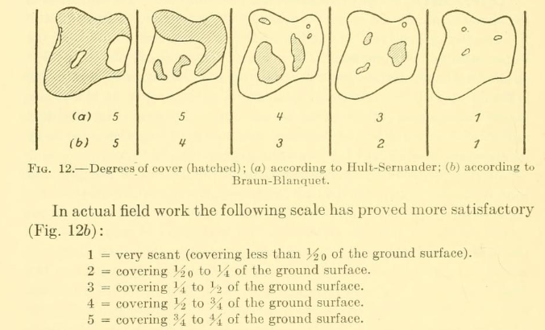

---
title: "Taller SADS - UNAM"
subtitle: "Ajuste a datos de frecuencia en clases de abundancia o cobertura"
author: 
  - "Paulo Inácio Prado (PI)"
date: '21 Septiembre 2026'
output:
  xaringan::moon_reader:
    lib_dir: libs
    css: ["../xaringan-themer.css", "../meu_estilo.css"]
    nature:
      highlightStyle: github
      highlightLines: true
      countIncrementalSlides: false
      ratio: '16:9'
self-contained: true
editor_options: 
  chunk_output_type: console
---

```{r setup, include=FALSE}
options(htmltools.dir.version = FALSE)
options(servr.daemon = TRUE)#para que no bloquee la sesión
knitr::opts_chunk$set(prompt = TRUE, comment = "",
                      out.width="90%", echo=FALSE,
                      warning=FALSE, message=FALSE)
```

```{r xaringan-themer, include=FALSE, warning=FALSE}
library(xaringanthemer)
library(ggplot2)
library(ggforce)
library(ggthemes)
## library(metR)
library(knitr)
library(kableExtra)
library(htmltools)
library(dplyr)
##library(tidyr)
library(janitor)
library(sads)
library(latex2exp)
xaringanExtra::use_share_again()
xaringanExtra::use_fit_screen()
xaringanExtra::use_tachyons()

style_solarized_light(
  title_slide_background_color = "#586e75",# base 3
  header_color = "#586e75",
  text_bold_color = "#cb4b16",
  background_color = "#fdf6e3", # base 3
  header_font_google = google_font("DM Sans"),
  text_font_google = google_font("Roboto Condensed", "300", "300i"),
  code_font_google = google_font("Fira Mono"), text_font_size = "28px",
  code_font_size="1rem"
)
# clipboard
htmltools::tagList(
  xaringanExtra::use_clipboard(
    button_text = "Copy code <i class=\"fa fa-clipboard\"></i>",
    success_text = "Copied! <i class=\"fa fa-check\" style=\"color: #90BE6D\"></i>",
    error_text = "Not copied 😕 <i class=\"fa fa-times-circle\" style=\"color: #F94144\"></i>"
  ),
  rmarkdown::html_dependency_font_awesome()
  )

```

## Clases de abundancia

.pull-left[

* Em muitos inventários ecológicos não é possível medir com precisão a
  abundância de cada espécie, seja pelo contagem de indivíduos ou por
  outra medida, como biomassa.

* Neste casos, as espécies são categorizadas em **classes de abundância**
  
* Um caso muito comum são as classes de cobertura para organismos
sésseis, como plantas ou bentos.]

.pull-right[
<div style="text-align:center; margin-bottom:10px">

<p style="font-size:0.7em; margin-top:2px">Escala de cobertura de  <a href="https://archive.org/details/plantsociologyst00brau/page/32/mode/1up" target="_blank">Braun-Blanquet (1975)</a></p>
</div>
]

---

## Estrutura de dados em classes de abundância

Os dados obtidos obtidos por este tipo de inventário são a classe de abudância de cada espécie:

<br>

```{r ejemplo-classes-abund}
grasslands |>
    arrange(-class) |>
    select(cover) |>
    head(6) |>
    kable(col.names = "Clase de Cobertura")|>
    column_spec(1,italic=TRUE)
```
Coverage class of plant species in plots in grasslands in Southern Brazil [(Vieira & Overbeck 2020)](https://lume.ufrgs.br/handle/10183/221527)

---

## Estrutura das SADs em classes de abundância

As SADs resultantes são tabelas de frequência de espécies em cada classe:

<br>

```{r grasslands-sads}
grasslands |>
    mutate(cover=factor(cover, levels =c("<1%","1-3%","3-5%", "5-15%", "15-25%", "25-35%")))|>
    group_by(cover)|>
    summarise(N = n()) |>
    kable(col.names = c("Clase de cobertura", "N especies")) |>
    kable_styling(row_label_position = "c")|>
    row_spec(1:6, align="c" )
```
.right[
[(Vieira & Overbeck 2020)](https://lume.ufrgs.br/handle/10183/221527)
]

---

## Como ajustar modelos de SADs a dados em classes?

.pull-left[
* Lembre que nossos modelos de SADs atribuem probabilidades a cada valor de abundância.

* No entanto, agora temos classes, que agregam mais de um valor de
  abundância. Como atribuir probabilidade as estas classes?

* Para buscar uma solução, vamos começar com um exemplo de
classificação de número de indivíduos em oitavas (pois oitavas são um tipod e classe de abundância). 
]

.pull-right[

```{r octavas-com-classes}
moth.class <- data.frame(octav(moths))
moth.class$lower <- c(0,moth.class$upper[-nrow(moth.class)])
moth.class$octava <-  with(moth.class, paste(lower,upper, sep="-"))

moth.class|>
    select(octava, Freq)|>
    head() |>
    kable(col.names=c("Octava", "N especies"))|>
    row_spec(1:6, align="c" )
```

]
---

## Como ajustar modelos de SADs a dados em classes?

.pull-left[

* Cada oitava inclui um ou mais valores de abundância.

* Qualquer modelo de SADs pode atribuir probabilidades a cada uma destas abundâncias

* Assim, a probabilidade que o modelo atribui à oitava, será a soma das probabilidades atribuídas às abundâncias que pretencem a esta oitava
]

.pull-right[
	
```{r octavas-com-probs}
	moths.class.p <-
    data.frame(abund = 1:8) |>
    mutate(oct=cut(abund, breaks=c(0,1,2,4,8),include.lowest=TRUE, labels=c("0-1","1-2","2-4","4-8")),
           prob = dls(abund, N=1000, alpha =20))
# 1. Trata os dados (evita erro de tipo no bind_rows)
df_prep <- moths.class.p |> 
  mutate(abund = as.character(abund))

dados_sem_subtotal <- df_prep |> 
  filter(abund %in% c("1", "2"))

dados_com_subtotal <- df_prep |> 
  filter(!abund %in% c("1", "2")) |> 
  group_by(oct) |> 
  group_modify(~ adorn_totals(.x, where = "row", fill = "-", name = "Subtotal")) |> 
  ungroup()

tabela_final <- bind_rows(dados_sem_subtotal, dados_com_subtotal)

# 2. Encontra os índices das linhas de subtotal
linhas_subtotal <- which(tabela_final$abund == "-")

 c1 <- "#f0f0f0" # Linha 1 (Cinza muito claro)
 c2 <- "#d9d9d9" # Linha 2 (Cinza claro)
 c3 <- "#bfbfbf" # Linhas 3 e 4 (Cinza médio)
 c4 <- "#969696" # Linhas 5 a 8 (Cinza mais escuro)

 tabela_final |> 
     kable(col.names = c("Abundância", "Octava", "Probabilidade"), digits =c(1,1,3))|>
     row_spec(1, background=c1)|>
     row_spec(2, background=c2, col=c2)|>
     row_spec(3:5, background=c2,col=c2)|>
     row_spec(6:10, background=c2, col=c2)
```
]
---

## Como ajustar modelos de SADs a dados em classes?

.pull-left[

* Cada oitava inclui um ou mais valores de abundância.

* Qualquer modelo de SADs pode atribuir probabilidades a cada uma destas abundâncias

* Assim, a probabilidade que o modelo atribui à oitava, será a soma das probabilidades atribuídas às abundâncias que pretencem a esta oitava
]

.pull-right[
	
```{r octavas-com-probs2}
 tabela_final |> 
     kable(col.names = c("Abundância", "Octava", "Probabilidade"), digits =c(1,1,3))|>
     row_spec(1, background=c2, col=c1)|>
     row_spec(2, background=c1)|>
     row_spec(3:5, background=c2, col=c2)|>
     row_spec(6:10, background=c2, col=c2)
```
]
---
## Como ajustar modelos de SADs a dados em classes?

.pull-left[

* Cada oitava inclui um ou mais valores de abundância.

* Qualquer modelo de SADs pode atribuir probabilidades a cada uma destas abundâncias

* Assim, a probabilidade que o modelo atribui à oitava, será a soma das probabilidades atribuídas às abundâncias que pretencem a esta oitava
]

.pull-right[
	
```{r octavas-com-probs3}
 tabela_final |> 
     kable(col.names = c("Abundância", "Octava", "Probabilidade"), digits =c(1,1,3))|>
     row_spec(1, background=c2, col=c1)|>
     row_spec(2, background=c2, col=c1)|>
     row_spec(3:5, background=c1)|>
     row_spec(6:10, background=c2, col=c2)
 
```
]

---
## Como ajustar modelos de SADs a dados em classes?

.pull-left[

* Cada oitava inclui um ou mais valores de abundância.

* Qualquer modelo de SADs pode atribuir probabilidades a cada uma destas abundâncias

* Assim, a probabilidade que o modelo atribui à oitava, será a soma das probabilidades atribuídas às abundâncias que pretencem a esta oitava
]

.pull-right[
	
```{r octavas-com-probs4}
 tabela_final |> 
     kable(col.names = c("Abundância", "Octava", "Probabilidade"), digits =c(1,1,3))|>
     row_spec(1, background=c2, col=c1)|>
     row_spec(2, background=c2, col=c1)|>
     row_spec(3:5, background=c2, col=c1)|>
     row_spec(6:10, background=c1)
 
```
]
---
## Formalizando
<br>
Seja $X$ uma variável aleatória discreta que representa a abundância de uma espécie, com suporte (conjunto de valores possíveis) 

$$\mathcal{X} = \{1, 2, 3, \ldots, n\}$$.
--
<br>
Uma classe de abundância $C_i$ é um subconjunto de $\mathcal{X}$, definido por um intervalo entre um valor mínimo $L_i$ (exclusivo) e um valor máximo $U_i$ (inclusivo):

$$C_i = \{x \in \mathcal{X} : L_i < x \leq U_i\}$$


---

## Formalizando

<br>
Um modelo $f(x)$ atribui uma probabilidade a cada valor possível de abundância:

$$f(x) = P(X = x), \quad x \in \mathcal{X}$$

--

<br>
Então a probabilidade de uma espécie tomada ao acaso pertencer à classe $C_i$ é a soma das probabilidades atribuídas pelo modelo a todos os valores de abundância contidos nessa classe:

$$P(X \in C_i) = \sum_{x=L_i+1}^{U_i} f(x)$$

---
## Distribuições de probabilidades contínuas

.pull-left[

* Para medidas de abundâncias contínuas (como massas, áreas ou cobertura), usamos modelos de distribuição contínuas (e.g. lognormal, exponencial, gama).

* Para estes modelos, a probabilidade sempre é calculada somando valores atribuídos pelo modelo, em um intervalo, por meio de uma integral:

$$ P(L \leq x \leq U) ~ = ~ \int_L^U f(x) \, dx $$
]

.pull-right[

```{r lognormal-probabilidad}

## 1. Curva lognomral com suporte até ca.1
meanlog <- -1.3
sdlog <- 0.45
tmp <- data.frame(x = seq(0, 1, length.out = 500)) |>
  mutate(y = dlnorm(x, meanlog = meanlog, sdlog = sdlog))
## 2. grafico base
p2 <- ggplot(tmp, aes(x = x, y = y)) +
  geom_line(linewidth = 1) +
  labs(x = "x", y = "f(x)") +
  theme_minimal(base_size = 16)
## 3. Intervalo de interesse
a <- 0.3
b <- 0.5
y_max <- max(tmp$y)
## 04. Grafico final
p2 +
  geom_ribbon(aes(x = x, ymin = 0, ymax = y),
              data = filter(tmp, x >= a & x <= b),
              fill = "blue", alpha = .5) +
  annotate("segment", x = (a + b) / 2, xend = b + 0.25, y = y_max * 0.55, yend = y_max * 0.75,
           arrow = arrow(length = unit(0.2, "cm"))) +
  annotate("label", x = b + 0.4, y = y_max * 0.8,
           label = TeX(sprintf(r"($\int_{%.1f}^{%.1f} f(x) \, dx$)", a, b), output = "character"),
           parse = TRUE, size = 6) +
    ggtitle(paste0("Probabilidad de abundancia entre ", a, " y ", b))
```

]
---
.left-column[
```{r , echo=FALSE, fig.align='center'}
include_graphics("../01_introduccion/figs/bora-la.jpg")
```
]

.right-column[

### ¡Vámonos!

Encuentra en nuestro sitio los [tutoriales](https://piklprado.github.io/sads_UNAM/02_ajustes.html):

* **Máxima verosimilitud** - *MLE a la fuerza bruta*

* **Ajuste** - *Ajuste y selección de modelos de SADs*           
]
